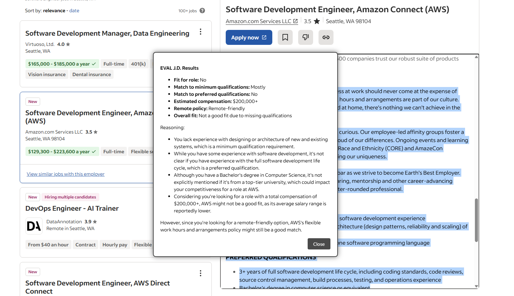

# Job Description Reviewer

A Tampermonkey script that helps you evaluate job descriptions against your resume using Groq's AI API to determine if a position is a good match for your skills and experience.

## Prerequisites

Before you can use this script, you'll need:

1. [Tampermonkey](https://www.tampermonkey.net/) browser extension installed
2. A [Groq Cloud API key](https://console.groq.com/)
3. Your resume in a text format

## Installation

1. Install the Tampermonkey extension for your browser:
   - [Chrome](https://chrome.google.com/webstore/detail/tampermonkey/dhdgffkkebhmkfjojejmpbldmpobfkfo)
   - [Firefox](https://addons.mozilla.org/en-US/firefox/addon/tampermonkey/)
   - [Edge](https://microsoftedge.microsoft.com/addons/detail/tampermonkey/iikmkjmpaadaobahmlepeloendndfphd)

2. Create a new script in Tampermonkey and copy the contents of `jd_evaluator.js` into it.

3. Replace `YOUR_GROQ_API_KEY` in the script with your actual Groq API key.

## Configuration

1. Update the `resumeText` variable in the script with your resume content
2. Modify the evaluation instructions in `evaluationPrompt` if needed to customize the analysis

## Usage

1. Navigate to any job posting page
2. Select/highlight the job description text you want to evaluate
3. Press the 'e' key to trigger the evaluation
4. The script will:
   - Process the selected job description
   - Send it along with your resume to Groq's AI
   - Analyze the match between your qualifications and the job requirements
   - Display the results in a floating window on the page

Note: Make sure you have highlighted the relevant job description text before pressing 'e'.

## Features

- Real-time job description analysis
- Compatibility scoring
- Skill gap identification
- Customizable evaluation criteria
- Works on most job posting websites

## Privacy & Security

- Your API key and resume data are stored locally in the script
- No data is stored on external servers beyond the API calls to Groq
- All analysis is performed through secure API endpoints

## Contributing

Feel free to open issues or submit pull requests if you have suggestions for improvements.

## License

This project is open source and available under the MIT License.

## Disclaimer

This tool is meant to assist in your job search process but should not be the sole factor in deciding whether to apply for a position. Always use your judgment and consider other factors when making career decisions.